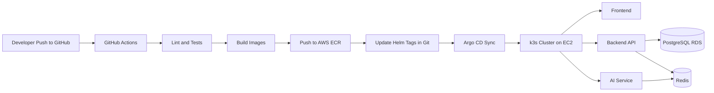
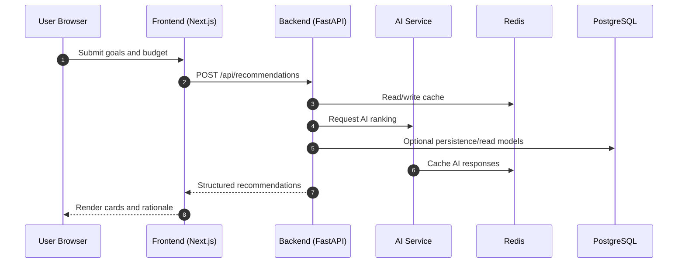
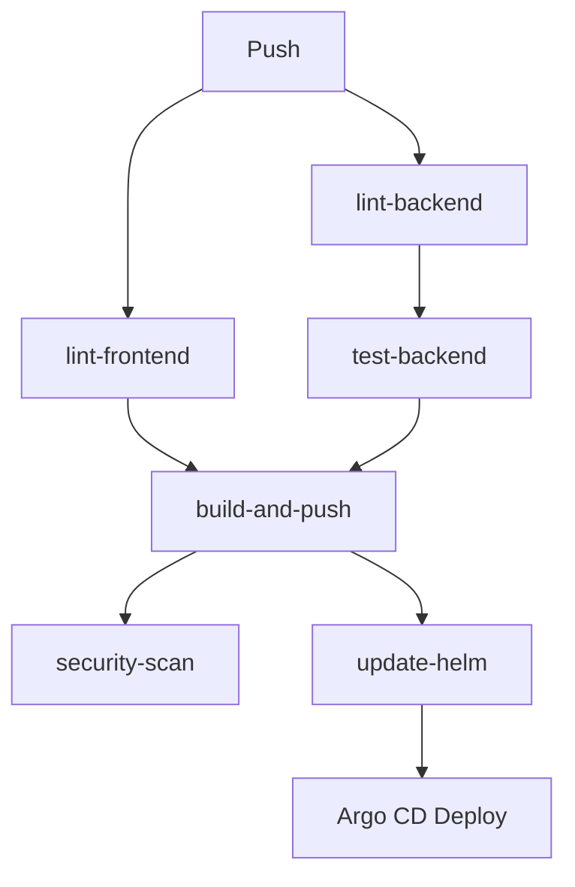

# LaptopAI

LaptopAI is an AI-powered laptop recommendation platform. Users describe goals and budget, and the system returns structured recommendations with practical specs (CPU, RAM, GPU, storage, and price).

This repository is designed as a full DevOps portfolio project: application code, CI/CD, GitOps, Kubernetes manifests, and Terraform infrastructure in one place.

## Tech Stack

| Layer | Technology |
|---|---|
| Frontend | Next.js 14 (App Router) |
| Backend API | FastAPI (Python 3.12) |
| AI Service | FastAPI + Gemini/OpenAI-capable adapter |
| Database | PostgreSQL 16 |
| Cache | Redis 7 |
| Containerization | Docker (Kubernetes images) + Docker Compose (local only) |
| CI/CD | GitHub Actions |
| GitOps | Argo CD |
| IaC | Terraform (AWS) |
| Kubernetes | k3s on EC2 |
| Ingress/TLS | ingress-nginx + cert-manager |
| Monitoring | Optional kube-prometheus-stack profile (disabled by default in dev) |

## Getting Started

### Local Development

**Prerequisites:** Docker, Docker Compose, Git

```bash
git clone https://github.com/qwerttt0745/LaptopAI.git
cd LaptopAI
cp .env.example .env
docker compose up -d
```

| Service | URL |
|---|---|
| Frontend | http://localhost:3000 |
| Backend API | http://localhost:8000 |
| Swagger Docs | http://localhost:8000/docs |
| AI Service | http://localhost:8001 |

### AWS Dev Environment (GitOps)

This path deploys to k3s on AWS and does not use Docker Compose.

```bash
cd infra/environments/dev
terraform init
terraform apply
```

After infrastructure is ready, bootstrap Argo CD apps:

```bash
cd ../../..
bash scripts/setup-argocd.sh <github_pat>
```

By default, app-of-apps deploys only cert-manager, ingress, and dev apps.
Monitoring is intentionally excluded for low-resource environments.

## Architecture



### Runtime Request Flow



## Repository Structure

```text
LaptopAI/
├── .github/workflows/      # CI/CD pipelines
├── frontend/               # Next.js app
├── backend/                # FastAPI backend
├── ai-service/             # AI microservice
├── infra/                  # Terraform modules and envs
├── k8s/                    # Argo CD apps + Helm charts
├── monitoring/             # Monitoring configs
└── scripts/                # Bootstrap and helper scripts
```

## CI/CD Pipeline

1. Push to `main` or `develop` triggers CI workflow.
2. Lint and tests run for backend and frontend.
3. Docker images are built and pushed to AWS ECR.
4. Image tags in Helm `values.yaml` are updated automatically.
5. Argo CD detects Git change and syncs to cluster.

### Pipeline Graph



## Branch Strategy

| Branch | Purpose |
|---|---|
| `main` | Stable branch for deployed environments |
| `develop` | Integration branch for active development |
| `feature/*` | Feature branches |

Commits follow [Conventional Commits](https://www.conventionalcommits.org/): `feat:`, `fix:`, `ci:`, `infra:`, `docs:`.

## DevOps Notes (AWS Trial Friendly)

This project includes a lightweight dev profile to stay practical on limited resources:

1. Single-node k3s deployment.
2. Conservative pod requests/limits in Helm templates.
3. Monitoring is disabled by default in app-of-apps to avoid memory pressure on small instances.
4. Security group admin CIDRs are configurable via Terraform variable `allowed_admin_cidrs`.

To enable monitoring manually when resources allow:

```bash
kubectl apply -f k8s/argocd/applications/monitoring.yaml
```

Before running `terraform apply` in `infra/environments/dev/terraform.tfvars`:

1. Set a real `db_password`.
2. Restrict `allowed_admin_cidrs` to your IP, not `0.0.0.0/0`.

## Interview Checklist

If you are reviewing this project as a recruiter/interviewer, the key areas to evaluate are:

1. End-to-end DevOps ownership (app + infra + delivery).
2. GitOps-based deployment model with Argo CD.
3. Practical reliability controls (health probes, rollout readiness).
4. Infrastructure codification with reusable Terraform modules.
5. Cost-aware decisions for small dev environments.
